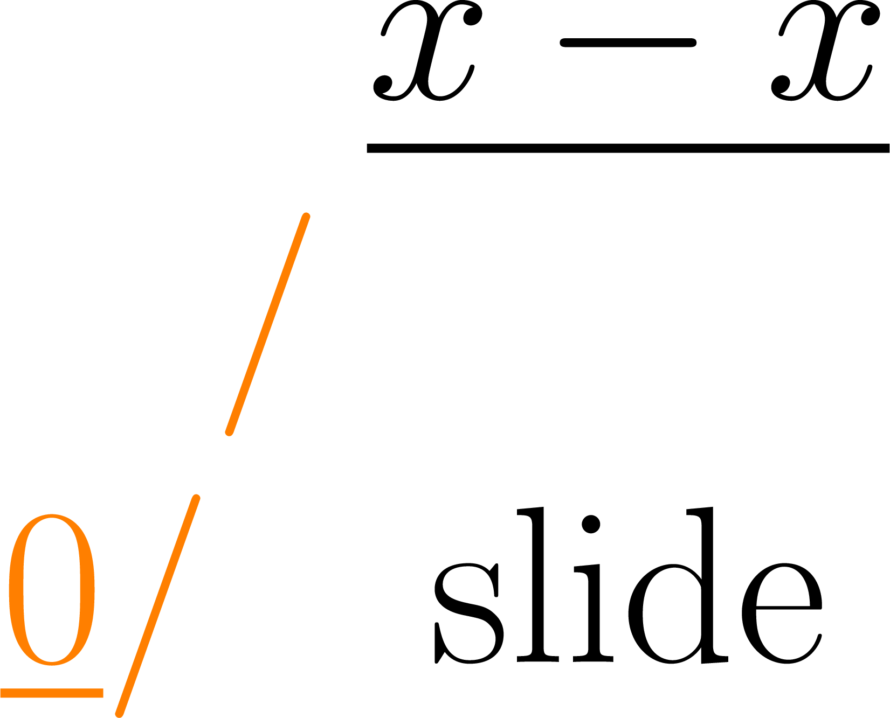

<p align="center">
  
</p>

# slide

slide is an static expression optimizer. Given an expression like

```
x(x + 2 * 3) / (x + 6)
```

slide should be able emit the lowered expression `x`.

One of slide's design goals is compilation as a platform, where optimizations are configurable
plugins.

Slide is not yet ready for use. All contributions are warmly welcomed.

## Development

Development documentation for slide, including documentation of private items, can be found in a
rustdoc at [slide-dev.ayazhafiz.com](https://slide-dev.ayazhafiz.com/libslide).

More development details will be added later.
